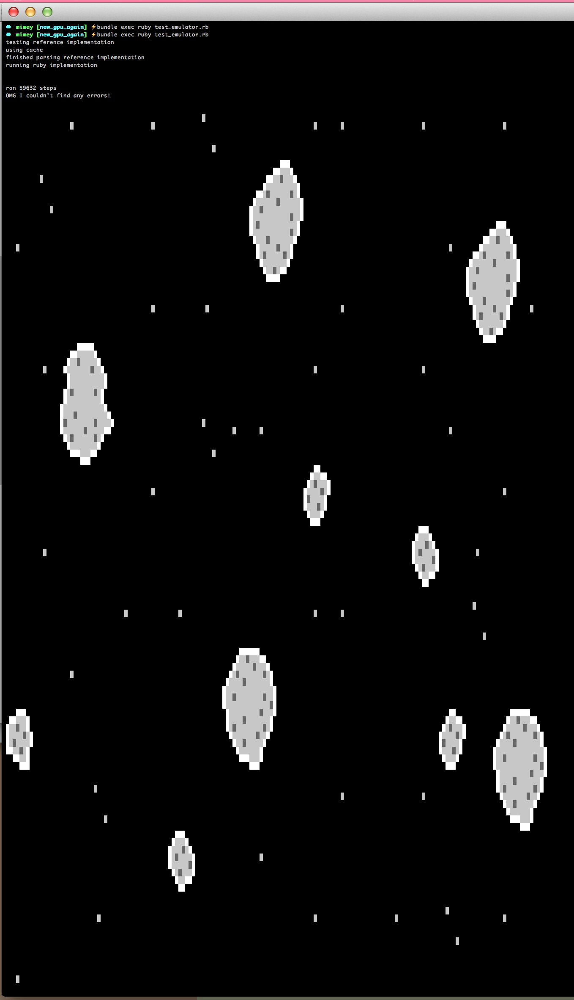

# Mimey

A [Game Boy][gameboy] emulator written in Ruby.

[gameboy]: http://en.wikipedia.org/wiki/Game_Boy

## Status

At the moment Mimey is in an almost-abandoned stage, but at least is capable of the first frame of a gameboy game.

If you actually want to work on it, you should check out ``master``. If you'd like to make it run, check out [``minimal``](https://github.com/eljojo/mimey/tree/minimal) (which is not minimal at all).

## How to run this?

Clone the repo:

```
git clone git@github.com:eljojo/mimey.git
cd mimey
```

Checkout the minimal branch

```
git checkout minimal
```

Bundle install

```
bundle install
```

RUN IT

```
bundle exec ruby test_emulator.rb
```

you should see something like the current status below. if you don't, ping me [@eljojo](https://twitter.com/eljojo)

## FAQ

### What does Mimey mean?

[Mimey][mimey] is one of my favorite characters from the
[Pokémon TV Series][pokemon-tv-series] and using the name of a
[Mr. Mime][mr-mime] seems appropiate for an emulator (specially for a Game Boy
one).

[mimey]: http://bulbapedia.bulbagarden.net/wiki/Mimey
[pokemon-tv-series]: http://bulbapedia.bulbagarden.net/wiki/Pokémon_anime
[mr-mime]: http://bulbapedia.bulbagarden.net/wiki/Mr._Mime_(Pokémon)

### What games does it run?

None at the moment.

### When will I be able to run games?

This is a side project, so I don't know.

### Your emulator sucks! Where can I find a decent one?

Mimey is a work in progress. In the meantime [let me help you find
one][emulators].

[emulators]: http://bit.ly/14hVUqL

### Why do you want to build yet another Game Boy emulator?

One of my dreams since I first used an emulator was to create one by myself, I
enjoy programming and I think this will be a great learning experience. My goal
is being able to run [Pokémon Red and Blue][red-blue].

[red-blue]: http://bulbapedia.bulbagarden.net/wiki/Pokémon_Red_and_Blue_Versions

## Acknowledgements

* [Nintendo][nintendo] for creating the Game Boy.
* [Satoshi Tariji][satoshi-tariji] for creating Pokémon.
* [Episode 64 of the Pokémon TV Series][episode-64] for making me like Mr.
  Mime. Before that episode I really hated Mr. Mime (who
  can hate that Pokémon? I can't remember why I hated it).
* The great tutorial of [Imran Nazar][imran-nazar] finally gave me the
  motivation to start writing this emulator.

[nintendo]: http://nintendo.com
[satoshi-tariji]: http://en.wikipedia.org/wiki/Satoshi_Tajiri
[episode-64]: http://bulbapedia.bulbagarden.net/wiki/EP064
[imran-nazar]: http://imrannazar.com/GameBoy-Emulation-in-JavaScript

## Current Status



## Licence

MIT.


